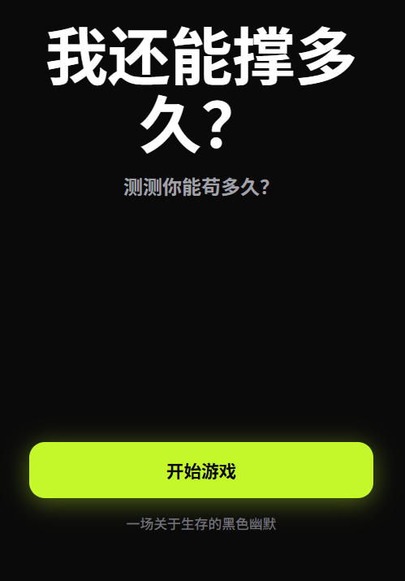
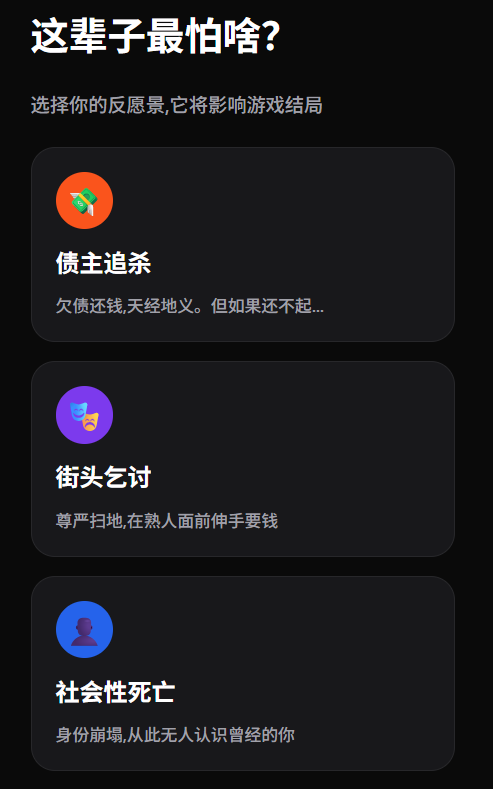
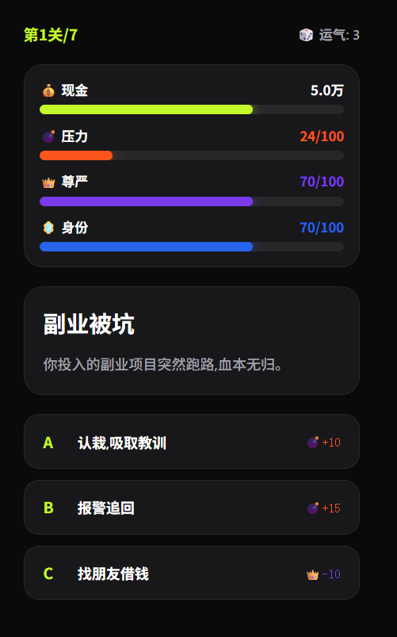

# 我还能撑多久？

一款关于生存的黑色幽默模拟游戏

## 游戏简介

这是一款戏剧性的生活模拟游戏，玩家需要在各种困境中做出选择，尽可能撑过更多关卡。每个选择都会影响你的现金、压力、尊严和身份值。






## 功能特点

- 🎮 **5个完整屏幕**：开始页、输入页、反愿景页、游戏循环页、结算页
- 🌟 **霓虹发光效果**：暗黑风格配合4色发光进度条
- 📊 **实时仪表盘**：追踪现金、压力、尊严、身份4项指标
- 🎲 **随机事件系统**：每关从事件池随机选择，高重玩性
- 💥 **即时反馈**：选择后立即显示影响，动画效果
- 📱 **移动端优化**：402px宽度，完美适配手机屏幕
- 🎭 **反愿景机制**：选择最怕的结局，影响游戏走向
- 🏆 **结算分享**：显示Top 3耻辱时刻，支持分享战绩

## 如何运行

### 方法1：直接打开

1. 双击 `index.html` 文件
2. 在浏览器中打开即可开始游戏

### 方法2：本地服务器（推荐）

```bash
# 使用Python启动本地服务器
python -m http.server 8000

# 或使用Node.js
npx http-server
```

然后在浏览器访问 `http://localhost:8000`

## 游戏玩法

1. **开始页**：点击"开始游戏"
2. **输入页**：设置初始现金、月收入、月支出、身份值
3. **反愿景页**：选择你最怕的结局（债主追杀/街头乞讨/社会性死亡）
4. **游戏循环**：
   - 每关面对一个随机事件
   - 从A/B/C三个选项中选择
   - 每个选择都会影响你的4项指标
   - 撑过7关或任一指标归零则游戏结束
5. **结算页**：查看你的战绩和耻辱时刻，分享给朋友

## 游戏机制

### 4项核心指标

- 💰 **现金**：生存的基础，归零则游戏结束
- 💣 **压力**：达到100则精神崩溃
- 👑 **尊严**：归零则社会性死亡
- 🪞 **身份**：归零则失去社会地位

### 7个关卡主题

1. 日常小确丧
2. 突发黑天鹅
3. 职场阴间
4. 心理爆炸
5. 极限压力
6. 越线前夜
7. 终极求生

### 游戏结束条件

- 现金 ≤ 0
- 压力 ≥ 100
- 尊严 ≤ 0
- 身份 ≤ 0
- 成功撑过7关

## 技术栈

- **纯前端实现**：HTML + CSS + JavaScript
- **无依赖**：不需要任何框架或库
- **响应式设计**：适配移动端和桌面端
- **暗黑主题**：#0A0A0A背景 + 霓虹发光效果

## 设计风格

- **配色方案**：

  - 背景：#0A0A0A（纯黑）
  - 卡片：#18181B（锌灰）
  - 强调色：#C4F82A（lime绿）
  - 现金：#C4F82A（绿色发光）
  - 压力：#FA541C（红色发光）
  - 尊严：#7C3AED（紫色发光）
  - 身份：#2563EB（蓝色发光）
- **字体**：

  - 标题：Space Grotesk（粗体几何字体）
  - 正文：Manrope（人文主义无衬线）
  - 代码：Space Mono（等宽字体）

## 文件结构

```
lifegame/
├── index.html      # 主HTML文件
├── style.css       # 样式文件
├── game.js         # 游戏逻辑
├── prd1.md         # 产品需求文档
├── pencil-new.pen  # 设计源文件
├── LICENSE         # 开源许可证
└── README.md       # 说明文档
```

## 浏览器兼容性

- Chrome/Edge 90+
- Firefox 88+
- Safari 14+
- 移动端浏览器

## 开发说明

游戏采用纯JavaScript实现，所有逻辑都在 `game.js` 中：

- `gameState`：游戏状态管理
- `eventPool`：事件池（7关 × 2-3个事件）
- `showScreen()`：屏幕切换
- `makeChoice()`：处理玩家选择
- `updateDashboard()`：更新仪表盘
- `checkGameOver()`：检查游戏结束

## 未来扩展

- [ ] 添加音效和BGM
- [ ] 更多事件和分支
- [ ] 成就系统
- [ ] 排行榜
- [ ] 多结局系统
- [ ] 存档功能

## 许可证

本项目采用 [MIT License](LICENSE) 发布。

## 作者

作者/版权持有人：anzx01

代码、中文文案、`prd1.md` 和 `pencil-new.pen` 设计源文件作为本仓库组成部分发布，并按 MIT License 授权使用。

## 素材与第三方内容

当前版本不包含第三方图片、音频、视频、字体文件或前端依赖库。界面使用系统 emoji 和 CSS 样式绘制，不单独分发图标或媒体素材。

CSS 中的 `Space Grotesk`、`Manrope`、`Space Mono` 和 `Inter` 仅作为字体族偏好声明；仓库没有打包这些字体文件，也没有从外部 CDN 加载字体。若未来引入字体文件、CDN 字体、图片、音效或其他素材，请同步保留对应许可证、版权声明和署名要求。

## 隐私说明

本项目为纯前端静态游戏。当前版本不使用服务器接口、Cookie、LocalStorage、统计脚本或第三方追踪服务，也不会上传玩家输入或游戏结果。

分享功能只在用户点击“分享战绩”后调用浏览器 Web Share API 或剪贴板 API，用于分享/复制当前战绩文本。

## 内容提示

本游戏包含债务、压力、失眠、药物、社会性死亡等黑色幽默虚构情节，仅用于娱乐表达，不构成医疗、法律或财务建议，也不鼓励任何现实中的高风险行为。
